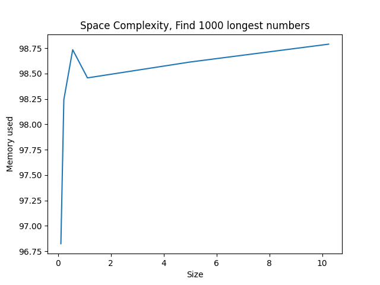

# topN

Application that given a number N and an arbitrarily long file that contains a single number per line, it must return the N longest numbers, ordered from highest to lowest.

# Installation

> Create Virtual Environment (optional)
```sh
$ python -m venv venv
```
> Install Dependencies
```sh
$ pip install requirements.txt 
```

# Usage
```text
Usage: 
    python topN.py [-h] --ifile IFILE --nnum NNUM

Optional arguments:
    -h, --help            show this help message and exit

Mandatory arguments
    -i, --ifile     Input large file
    -n, --nnum      N longest numbers

```

## Examples

> Input file size `1 GB`

```bash
python topN.py -i numbers.txt -n 10
[ ] Calculating...
[ ] Execution Time: 17.47 seconds
[ ] Result:
    value
 99999999
 99999998
 99999997
 99999996
 99999995
 99999994
 99999993
 99999992
 99999991
 99999990
 ```

# Generate large file

```text
Usage: 
    python genFile.py [-h] --size size

Optional arguments:
    -h, --help            show this help message and exit

Mandatory arguments
    -s, --size     set size file in GB (aprox.)
    -o, --ofile     set output file
```

Generates a file of the specified size with a random number in each row (from a range 1.000.000.000, 9.999.999.999)

## Example

> Generate file `1 GB`
```sh
python gen_file.py -s 1 -o numbers.txt
```
> Output
```text
- numbers.txt

    3607997977
    1342055735
    4213026521
    8531668766
    9135391882
    9727801137
    5934983670
    8763485653
    5043148559
    1578338518
    ...
    ...
```

# Time Complexity

> Linear Time: O(n)

Measures:
- Time in seconds
- Size in GB


# Space Complexity

The algorithm is not memory intensive, so the cost of space is 0 (1)

Measures:
- Memory used in Mb (RAM)
- Size in GB


